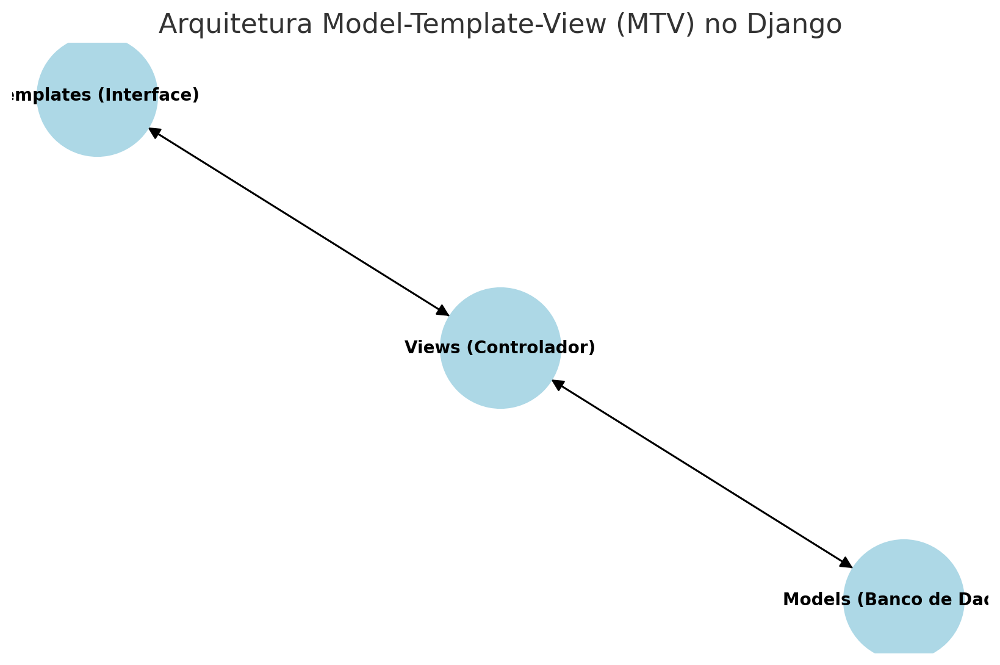
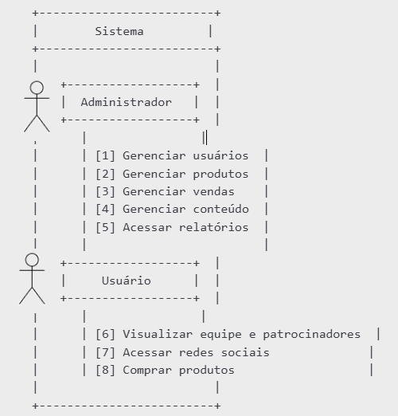

# <a> Documento de Arquitetura </a>

---

## <a> Histórico de Revisão </a>

| Data | Versão | Descrição | Autor |
| ----- | ----- | ----- | ----- |
| **16/12/2024** | 0.1 | Início do Documento de Arquitetura   | Eduardo de Almeida Ferreira Esdras de Sousa Nogueira Felipe de Aquino Campelo João Vitor Sales Ibiapina Luiz Guilherme Morais da Costa Faria Matheus Menezes Rodrigues Miguel Pires Gomes Pedro Rocha Thiago Melo Tonin Uires Carlos de Oliveira	  |
|  **17/12/2024** | 0.2 | Revisão final do Documento de Arquitetura | Eduardo de Almeida Ferreira Esdras de Sousa Nogueira Felipe de Aquino Campelo João Vitor Sales Ibiapina Luiz Guilherme Morais da Costa Faria Matheus Menezes Rodrigues Miguel Pires Gomes Pedro Rocha Thiago Melo Tonin Uires Carlos de Oliveira |
| **18/12/2024** | 0.3 | Revisão final do Documento de Arquitetura | Eduardo de Almeida Ferreira Esdras de Sousa Nogueira Felipe de Aquino Campelo João Vitor Sales Ibiapina Luiz Guilherme Morais da Costa Faria Matheus Menezes Rodrigues Miguel Pires Gomes Pedro Rocha Thiago Melo Tonin Uires Carlos de Oliveira |
|  |  |  |  |

Autores:

| Matrícula | Nome | Descrição do papel assumido na equipe | % de contribuição ao trabalho (\*)1 |
| :---: | :---: | :---: | :---: |
| 221008632 | Eduardo de Almeida Ferreira | Product Owner/Dev | 10 |
| 222006230 | Esdras de Sousa Nogueira | Dev | 10 |
| 231011328 | Felipe de Aquino Campelo | Dev | 10 |
| 222006857 | João Vitor Sales Ibiapina | Dev | 10 |
| 231011696 | Luiz Guilherme Morais da Costa Faria | Dev | 10 |
| 221008712 | Matheus Menezes Rodrigues | Scrum Master/Dev | 10 |
| 222007030 | Miguel Pires Gomes | Dev | 10 |
| 222034270 | Pedro Rocha | Dev | 10 |
| 221022453 | Thiago Melo Tonin | Dev | 10 |
| 202043307 | Uires Carlos de Oliveira | Dev | 10 |
| TOTAL | \------------------------------- | \--------------------------- | 100 |

1 (\*) – para cada integrante da equipe, considere sua participação tanto no Documento de Arquitetura, quando nos demais documentos já entregues pela equipe (Visão do produto e do projeto; Declaração de escopo) e atribua um, percentual. A soma dos percentuais de todos os integrantes deve fechar em 100%)

---

## <a> 1. Introdução </a>

### <a> 1.1 Propósito </a>

Este documento descreve a arquitetura do sistema sendo desenvolvido pelo grupo Gemini, na disciplina de MDS \- Métodos de Desenvolvimento de Software (2024.2), E-Commerce FGR, a fim de fornecer uma visão abrangente do sistema para desenvolvedores, testadores e demais interessados.

---


### <a> 1.2 Escopo </a>

O projeto de E-commerce para a  equipe de competição da Universidade de Brasília, FGR (Formula Racing Gama)  propõe a criação de um sistema de vendas e divulgação de marca para a equipe, que visa solucionar problemas em ambas áreas. Após as reuniões de alinhamento com os clientes, nossa equipe visa trazer um sistema funcional e profissional que satisfaça todas as exigências feitas pelo cliente. Mais sobre o projeto no “Documento de visão \- Gemini”.


---

## <a> 2. Representação Arquitetural  </a>

### <a> 2.1 Definições </a>

O sistema será desenvolvido utilizando a arquitetura do Django, que segue o padrão Model Template Control (MTC). Essa arquitetura é semelhante ao padrão MVC (Model View Controller), mas com uma distinção importante: o foco está na interação direta entre as Templates e as Views, facilitando a geração de páginas dinâmicas e a separação de responsabilidades.

**Camada de Lógica de Negócios (Model):** Os Models representam os dados fundamentais do e-commerce, como produtos, categorias, usuários e pedidos. Representam a lógica de negócios, realizando operações de leitura e escrita no banco de dados, garantindo a integridade dos dados e validando as regras de negócio.

**Camada de Apresentação (Template):** É responsável por exibir os dados fornecidos pela camada de lógica de negócios ao usuário final. Não contém lógica de negócios, apenas formata os dados de forma interativa.

**Camada de acesso a dados (Controller):** É responsável por agir como intermediário entre o Model e o Template. Elas recebem as requisições dos usuários, como a adição de itens ao carrinho ou a realização de um pagamento, e interagem com os Models para manipular dados conforme necessário. determinam quais dados serão recuperados ou atualizados nos Models e selecionam os Templates apropriados para exibir as informações ao usuário.  
![][image1]


---


### <a> 2.2 Justifique sua Escolha </a>

O padrão MTC foi escolhido porque oferece uma estrutura leve e eficiente, adequada à simplicidade do sistema. Ele prioriza a rapidez no desenvolvimento e facilita a organização do código, ao mesmo tempo em que mantém uma separação clara entre as responsabilidades. Essa abordagem reduz a necessidade de configurações complexas e permite que o foco esteja na entrega funcional do produto, garantindo um sistema escalável para futuras melhorias. Além disso, o MTC aproveita nativamente os recursos do Django, otimizando o uso de suas ferramentas e tornando o processo mais produtivo e intuitivo.

O Django fornece uma maneira flexível e poderosa para lidar com a separação e com a lógica da programação em backend, pois através de arquivos que estruturam a parte estrutural e visual de páginas web. Além disso, ele também fornece suporte ao desenvolvimento rápido e um design limpo.


---


### <a> 2.3 Detalhamento </a>

O projeto utiliza o padrão arquitetural **Model-View-Controller (MVC)**, amplamente adotado no desenvolvimento de aplicações web devido à sua capacidade de organizar de maneira clara e modular os componentes de um sistema. No contexto do framework Django, o padrão MVC é implementado com algumas adaptações específicas ao framework, sendo comumente referenciado como **Model-Template-View (MTV)**. Essa abordagem garante uma separação de responsabilidades que facilita o desenvolvimento, manutenção e escalabilidade do sistema.  <br><br>
O **Modelo** é responsável por representar os dados e a lógica de negócios do sistema. Ele inclui classes que definem as entidades do domínio, seus atributos e seus relacionamentos, sendo diretamente mapeadas para tabelas no banco de dados relacional (utilizando o ORM integrado do Django).  <br><br>
**Principais Funções do Modelo:**

* Definir as entidades do domínio do projeto, como Produtos, Pedidos, Usuários, entre outros.  
* Especificar atributos e tipos de dados associados às entidades.  
* Implementar relações entre entidades, como um-para-muitos (Ex: um cliente pode ter vários pedidos) e muitos-para-muitos (Ex: um produto pode pertencer a várias categorias).  
* Fornecer métodos e validações relacionados à lógica de negócios.

A **Visão** em Django desempenha o papel do **Controlador** tradicional do MVC, agindo como intermediária entre o **Modelo** e os **Templates**.  
**Principais Funções da Visão:**

* Receber e processar requisições HTTP.  
* Manipular os dados recebidos e chamar os Modelos para interagir com o banco de dados.  
* Preparar os dados e enviá-los aos Templates para renderização.  
* Retornar respostas HTTP, como páginas HTML ou dados em formato JSON (para APIs).

Os **Templates** desempenham o papel da **Visão** no padrão MVC clássico, fornecendo ao usuário final uma interface amigável e responsiva.  
**Principais Características dos Templates:**

* Utilizam a **linguagem de template do Django** para inserir dados dinâmicos.  
* Suportam **tags** e **filtros** para manipulação de dados antes da renderização.  
* Separaram a camada de apresentação da lógica de negócios.

**<p style="text-align: center;">Figura 1: Esquema de Camadas do Sistema</p>**



**<p style="text-align: center;">Autora: GEMINI (2024)</p>**


---

### <a> 2.4 Metas e Restrições Arquiteturais </a>

Para definir as metas de arquitetura do software, são consideráveis os seguintes aspectos:

* **Escalabilidade**: O sistema precisa ser capaz de crescer para suportar um número cada vez maior de usuários e dados ao longo do tempo. É essencial que a infraestrutura consiga lidar com essa expansão sem comprometer o desempenho..  
* **Desempenho**: O software deve oferecer respostas rápidas e manter um desempenho eficiente, garantindo uma experiência satisfatória para os usuários.  
* **Manutenibilidade:** A estrutura do software deve ser projetada para facilitar sua manutenção e evolução ao longo do tempo, possibilitando a adição de novas funcionalidades, correções de erros e melhorias contínuas de maneira ágil e eficiente.  
* **Segurança:** É fundamental proteger o sistema contra acessos não autorizados, assegurando a integridade e a confidencialidade das informações.

Ao definir as restrições arquiteturais para o software de divulgação e gerenciamento, é importante considerar os seguintes aspectos:

* **Compatibilidade:** O sistema precisa ser funcional em todas as máquinas.

Esses objetivos e restrições arquiteturais devem ser avaliados com atenção e incorporados ao desenvolvimento do sistema, de forma a atender plenamente às necessidades da equipe de competição e garantir um funcionamento seguro e eficiente.


---


### <a> 2.5 Visão de Casos de Uso (escopo do produto) </a>

A arquitetura escolhida para  o sistema segue o padrão **Model-View-Control (MVC)**, utilizando os framework **Django** para o backend, que foi escolhido pela facilidade que se comunica com o **React** (frontend)  e pela forma que consegue atender com perfeição as necessidades do projeto, trazendo para o cliente um sistema de administração funcional e de fácil manuseio, segurança nos acessos da aplicação e fácil comunicação com as APIs.

A linguagem escolhida para o frontend foi o **React**, que se integra e se comunica com facilidade ao framework **Django**, e pela capacidade de criar o escopo do site de acordo com os pedidos do cliente. O banco de dados adotado foi o **PostgreSQL**, escolhido exclusivamente por ser o melhor sistema para se comunicar com o backend.

Em relação ao escopo do sistema, ele pode ser segmentado em módulos responsáveis por diferentes funcionalidades, incluindo:

* **Página de apresentação da equipe e patrocinadores**  
* **Acesso direto as redes sociais da equipe.**  
* **Página de vendas dos produtos da equipe**  
* **Página de administração:** controle total sobre e manutenção sobre toda a aplicação

O sistema também incorpora **dois níveis de usuários**, cada um com permissões específicas, conforme descrito a seguir:

* **Administrador:** controle total sobre todas funcionalidades do site e acesso a relatórios de venda.  
* **Usuário**: Acesso às páginas de apresentação da equipe, patrocinadores e página de produtos.


O diagrama a seguir ilustra os diferentes casos de uso da aplicação e as interações mencionadas acima.

**<p style="text-align: center;">Figura 1: Casos de Uso</p>**



**<p style="text-align: center;">Autora: GEMINI (2024)</p>**
---


### <a> 2.6 Visão Lógica </a>


A visão lógica é a apresentação da estrutura do projeto, como está o seu desenvolvimento e integração com cada parte do sistema/web. Cada parte do sistema/web interagindo e ligado aos outro componentes assim tornado o sistema com eficiência e agilidade, nas suas conexões, quando o usuário pede uma informação, essa deve ser de forma rápida retorno e confiabilidade.

* Módulo autenticação  
* Módulo cadastro de usuário  
* Módulo Gerencial  
* Módulo Configurações

     1-Módulo de autenticação/cadastro de usuário e de administrador, nesse módulo o cliente/usuário irá gerar um cadastro para poder efetuar compras no sítio/web, nesse caso usando nome pessoal, e-mail pessoal, dentro das regras de lei do sigilo de dados pessoais. Em que será possível novos usuários efetuarem o cadastro e podem efetuar a recuperação de senha em e-mail, efetuando também compras no site. 

     2- Módulo Gerencial/relatório/configurações, em que o administrador da FGR poderá nosse módulo ter relatórios, acessar o sistema com login e terá acesso aos relatórios verificação de valores pagos pelo usuário, bem como a manutenção, podendo alterar, incluir, excluir, dados e produtos, sendo que o sítio terá acesso somente para o administrador uma forma de módulo de configuração, pois os dados ficarão de forma editável, ou seja, o Adm., poderá efetuar ajustes, excluir fotos de produtos, incluir valores, excluir produtos, editar o painel do Adm. O usuário não poderá editar nenhum dado nem inserir foto em perfil.

 


    A razão lógica de cada módulo passa pela seguinte situação, sendo que a autenticação tem segurança para FGR e para os usuários, pois o cadastro requer dados e são guardados em banco com segurança criptografia. 

     A razão para o gerenciamento/relatório/configurações desde a gestão de dados, com informações para tomada de decisão de qual produto colocar no sitio, e ainda poder gerenciar o sítio tornando mais atrativo quando o Adm. achar que deve devido o mercado exigir.

Esses módulos se comunicam por meio da interface:

* Autenticação \> cadastro \= dado validado \= usuários comprando no sítio;    
* Cadastro \> configurações \> gerenciamento de dados/ conteúdo \= Administrador emitindo relatórios;

A seguir o diagrama de estados da aplicação e sua explicação:

*![][image2]*  
Foi demonstrado não autenticado depois autenticado, não apresentamos erro no sistema, usuário efetua transações no sítio. 

A seguir o diagrama de atividades e sua explicação:

![][image3]

O usuário a partir do acesso poderá ser negado e possíveis erros podem acontecer, mas pode recuperar a senha.

A seguir o diagrama de de classe que representa como os dados são persistidos pela aplicação e sua explicação:

```bash
classe Usuario {
    id: int
    nome: string
    email: string

    autenticar()
}

classe Produto {
    id: int
    nome: string
    preco: float

    adicionarCarrinho()
}

classe Pedido {
    id: int
    data: date
    total: float

    finalizar()
}

```


--- 


### <a> 2.7 Visão de Implementação </a>


---


### <a> 2.8 Visão de Implantação </a>

O software será implantado como uma aplicação web, seguindo o padrão de aplicação modernas. Para o desenvolvimento, utilizaremos JavaScript, React, Vite para a stack Front-End, essa escolha visa criar uma interface de usuário dinâmica, responsiva e de alta performance, atendendo às demandas de um e-commerce. 

No Back-End, será utilizado Python com o framework Django, devido á sua robustez, segurança e ferramentas nativas que aceleram o desenvolvimento de aplicações web, já que o framework oferece um suporte integrado a autenticação, gerenciamento de usuários e conexão com banco de dados, simplificando a arquitetura do projeto. 

Para o banco de dados, optamos pelo PostgreSQL como banco de dados relacional, devido à sua confiabilidade, suporte a consultas complexas e alto desempenho, que serão úteis para a gestão de dados do e-commerce. Além disso, sua integração com Django é simples e eficiente, reduzindo a complexidade do desenvolvimento. Será utilizado PowerBI para a criação de relatórios sobre as vendas, que será alimentado pelas informações armazenadas no banco de dados PostgreSQL. O Power BI é uma ferramenta que facilita a visualização e análise de dados, oferecendo insights sobre o desempenho de vendas, comportamento dos clientes e outros indicadores chaves para auxiliar nas tomadas de decisões melhores e estratégicas.


---


### <a> 2.9 Restrições Adicionais </a>

**Autenticação Obrigatória**  
O sistema será acessível diretamente pela internet, porém exigirá que os usuários se cadastrem e loguem para terem acesso às páginas de produtos e compras, assim como será necessário logar em perfil de administrador para ter acesso ao painel de controle. Usuários não cadastrados terão acesso limitado, apenas podendo navegar pelo site sem poder efetuar compras.

**Limitação de acesso**  
Funcionalidades especiais, como página de administração, estoque, serão unicamente acessadas pelos perfis de administrador, enquanto usuários terão acesso apenas às páginas de navegação e compra do site . A divisão de acessos conforme os perfis melhora a segurança do sistema, restringindo recursos críticos a usuários com as permissões adequadas e organizando melhor os fluxos de trabalho.

**Portabilidade**  
A aplicação será compatível com todos navegadores, como **Chrome, Firefox, Safari e Edge**. Assegurar compatibilidade com múltiplas plataformas possibilita que os usuários acessem o sistema de forma prática, independentemente do dispositivo utilizado.

---


## <a> 3. Referências Bibliográficas </a>

*Arquitet*ura MVC: entendendo o modelo-visão-controlador. DIO.me, 2024\. Disponível em: [https://www.dio.me/articles/arquitetura-mvc-entendendo-o-modelo-visao-controlador](https://www.dio.me/articles/arquitetura-mvc-entendendo-o-modelo-visao-controlador). Acesso em: 18 dez. 2024\.


[image1]: <data:image/png;base64,iVBORw0KGgoAAAANSUhEUgAAAhwAAAE8CAMAAAC8ZJjlAAADAFBMVEX///9LS0vw8PDl5eWOjo4AAACFhYV1dXXe3t5VVVX29vZra2vMzMy9vb21tbWkpKR9fX309PRiYmLFxcWqqqrZ2dnq6uqWlpaenp6oqKhRUVFoaGhbW1vPz8/j4+NJSUmKioo/Pz8zMzM7OzsuLi4hISEXFxccHBwpKSkNDQ0REREAAAAAAAAAAAAAAAAAAAAAAAAAAAAAAAAAAAAAAAAAAAAAAAAAAAAAAAAAAAAAAAAAAAAAAAAAAAAAAAAAAAAAAAAAAAAAAAAAAAAAAAAAAAAAAAAAAAAAAAAAAAAAAAAAAAAAAAAAAAAAAAAAAAAAAAAAAAAAAAAAAAAAAAAAAAAAAAAAAAAAAAAAAAAAAAAAAAAAAAAAAAAAAAAAAAAAAAAAAAAAAAAAAAAAAAAAAAAAAAAAAAAAAAAAAAAAAAAAAAAAAAAAAAAAAAAAAAAAAAAAAAAAAAAAAAAAAAAAAAAAAAAAAAAAAAAAAAAAAAAAAAAAAAAAAAAAAAAAAAAAAAAAAAAAAAAAAAAAAAAAAAAAAAAAAAAAAAAAAAAAAAAAAAAAAAAAAAAAAAAAAAAAAAAAAAAAAAAAAAAAAAAAAAAAAAAAAAAAAAAAAAAAAAAAAAAAAAAAAAAAAAAAAAAAAAAAAAAAAAAAAAAAAAAAAAAAAAAAAAAAAAAAAAAAAAAAAAAAAAAAAAAAAAAAAAAAAAAAAAAAAAAAAAAAAAAAAAAAAAAAAAAAAAAAAAAAAAAAAAAAAAAAAAAAAAAAAAAAAAAAAAAAAAAAAAAAAAAAAAAAAAAAAAAAAAAAAAAAAAAAAAAAAAAAAAAAAAAAAAAAAAAAAAAAAAAAAAAAAAAAAAAAAAAAAAAAAAAAAAAAAAAAAAAAAAAAAAAAAAAAAAAAAAAAAAAAAAAAAAAAAAAAAAAAAAAAAAAAAAAAAAAAAAAAAAAAAAAAAAAAAAAAAAAAAAAAAAAAAAAAAAAAAAAAAAAAAAAAAAAAAAAAAAAAAAAAAAAAAAAAAAAAAAAAAAChPAEcAAAVaElEQVR4Xu2diVsaSxbFL/siCiiiMdHEvMybb/7/P2bmm3nJS2I0bqiRRRaBObfaBTteaRBB6PNLEKhumu7m1KlbXdVVIoQQQgghhBBCCCGEEEIIISQoEX/CwrMpS/LFnzgN/iU/5dyf+KoJnzji0peuP3EaFORSev7EV03Un0DILXF/QghIzMY5rvwJrx46BzEJo3ME552cSQPnKC5b0pSUVOVUMjcWsCSSR4CZnrMgcxRmK46stOUazymRVUnKMX6BGDw/LWWEbur9FenMMohLYM8aksNzRA7w/k847ZL8jVfbunsHsg71LC4sVojJbJ1DPUOdA+bw073pu7dF+Ya/W8iZa3CR/YefmC4tPBooP2JwjJR8we7tuvQ92RB5L4eziW2nBJ2DmMzaOdoI8Ipyoi+zKNg1o96yJCVk1sGUqdPGTjTkrXyXZakj9iggIPVIw+TgbxvIXep5iwmdg5jM2jnKCCki8knk3/4lKN7PkWlvs+pMaMMtcqhEdVGVEjmSj8hMPxAM/YSTrAgSU/LV/5kFYrZtK1nUYH+IVhlRZS1iZ7yK4R/yGX93XZ1x4uhVi6Y/cRqkZlstHwMWK8Rkts4xLbblCqbkZVs6R2DoHMRk1gHpdPgF54gh6ybkUtbwjgRiIcSRR+Wh4U+8J4Oj1Maya/xL3BUvT1NGVURD5Vv+gWqT0cIWhermrzk+CCxWiMmsnCOJUPgNcmPNv+BxynLsTxrg17CSonTzvCV1qbqG32EkseYHfGkG2Ucdo+uukRalj7SorEtLt6GecYoFGdTJK/4tLAB0DmIyK+d4IyfI7pvyFwLErlYtm7Lh4oYIYsYccqJ2xl1GftxEoBCRApZf+rcxCu+R77uusVerssOJwS+0aecau7HjeqtfYJ8b7ipdCX872CI2GZVVmEhC0gvpHEFO1MuQxQ9whrN7hpMN2z/ByxwEkMKCJZz2N/ITkujg9T5EsofHM8RxOuJV+KhzVBXIB/zqbdFiRmWShUarotdNvujzBcqpNl6knwqH5xgWK8Rkds7RhDH0EOKtoB5Y077ZXlcf7Ze3jL8/UN7UkHmPUdzUEPIFjFwng1fZvcAetl2Tmzb9qM9pb0b1kShSW7pax+1XE/tXv/vw4kDnICazc44a4riifIVznMo7gVtUkf+0cE8iuY7X18iXentaBP9qT1/mmjwaCR8i61yIRkfai7HhMtIedq6C3Wurg8SwSIOZ8oJ2+JlVw5t3rUEvaTdk3esJVsabOrw77X4FTa7jbwxOfoIfoSTfH25hXII2vKlaHyeLHXSl3I7rL1+GgN0BDIENb2SBmJVzPEr5uVczghDUOSYOnYMsELMLSB/hqfaTCbI8iyyhd1V2/ImvnFdVrEwF7RqsdZBx2EJN5Rn3SvSnW+N6NjPIQ2ReCJ9zPAevhSU00DmIyasKSOeAUDktnYOYUBzEhOIgJhQHMaE4RiGrrffhgbWVUejpkC3hgc5BTEJVbx/grdTlShIBu6aOPFTI2s2tCrfP8wmdg5iENeaIu5bZlmujvcS7rLt/5hyZRQeGy0hM2qLj5F7LEjL/oftMHj7bxN84ljb1DsyuvJFjbGRDqq4PUQQbWHF3Ql26XoZ5PKdlE1+lA/DOH3QOYhLWmOMTog29TSYvX+QdzsIp/CIKE9B7GxPSwbI8jKGCLK8DcO+6QcpSsIEe3mt/v6h2NYzAYtaxgZSUkaC3bx4jkOnCPQryX9Eb446R5t3i+YxuIDMjrMVK18ngwlVNT9ywgCf4DfP4XbOQTQnvtH/8CiSgt07cNtMncb4qTj4ZHb2jhI2o9calITpi6i/oKIqi5rYfrN6en0BaHfpTdc0bLFaISVid4/BmMJ4esnwJLqEhZ97dRaN3Umn6d/jEsisr9K5HJQNvOUZqGrFmW2/EisEtrlGErMo3fLgOG1JraSPH7aGU0ru23sB6IvjAPIajdA7yBGENSLN3fX01kvRzv1Qp+kYDu/vECpzi9G5lb/ShItxE33upg3/nj7CKYyLERCPbxYXFCiGEkAnCmCMI93MCeYNG/MaHhZxaI6zXOfJuYI0DVC6qbjaPpBsYriTXeHWB90c6hxuizVOcoXeorbSQfjvEYc5dQj/SzeiF8u+y6Vr+dZMbbkzUODaz4a0w1zAgJSZhdQ4tULtuAuFr2ZJDuEJaVt24b0lnATrWqLbI5+Avh/IeTtHEudqAv/yCi6SQvqZjQyXwBi/wsRU8vHa5GDYdc9XceYfOQUzC6RwxeMKBG7CujQzfQ+bvuYnJN+UYPnICC7iST/JveEcEoUMD7qKts4fwkx6CjHM8tBMQnKOC1WtI2EJCF5u9dH2BtPeQjkg574RTHGvyGZ6Zxt9NhJs6R/olnnV0Ou0d9k723VD6SazTgIzqqIrkIYsNN2FoC8XPuezejl+XRLnzt+gA+avYUNd1AklAW7nB75tTWKwQk7Be59C7k3So5CV4RgPZX0PNxoN2Mu0P5q3ppWvz2+DrB3gfuU+e16a2h9A5iElYncNjB2GoXr9aEx1k/SE6gnHICbc4RmUHcecilBcBYbFCTMJZlR2X+bzDYGzoHMRkEZoApkev0w/TIAx0jtFY02a2sEBxEBNWZYOSlpzU3Z32izkt0yPQOYgJnSMopbs50edtZoyx4XWOoNzevZQMjzhYrBATFivB0dlMtcP5PI8BNxJ0DmLCmCM4BTfDsDeuRyhgsRKcqMSkLPv+5MWFxQoxMZxj/a5S/2JoR+1ZsGZOQz6MHs7WtbyXA/+CoOjAcvMEnYOYGM6xIkvuDowXYk3OJB1w3PFJE5f82PPKapPsmCdlDaZz8cgIU68ZOgcxMZ2jP3bRHIg32PysnCOuow9PHx34eL6cY1bXOeYrMgspLFaICcVBTCgOYkJxEBOKg5hQHMSE4iAmFAcxoTiICcVBTCgOYkJxEBOKg5hQHMSE4iAmFAcxoTiICcVBTCgOYjJuH1JvcrOsJB7c/bQu7Zv3RWm8zJidaclgw0tyMpCWhcZfqLfyOh76VStu+Pzp93zVCa6V2ykIdVB+b8prJYt03xD9k4TOQUzGdY6WXIoqV31iHVvRQdRW4Bt6q4NOVtSTXfnPw4+MhmYKzSLexPFRbFSzSFaWkYFjA6akc2PkpIs1ElIRnWFnotn7zM0SGZWqrGLz63h1Atuq4lgv9Ualq8l+2w0pHR+2gbNYwKFF5BgHnca5beIQl+VCSjhcPQElnIpj+QN7cm+jD+fyMGb2MJJ/g85BTMZ1jjc3d/fFkYdqkOIStBxBRupB9iv4e/nckbNWkGkOEV/0UMgmpI/nBDLPFb6qhq9uIRMn8VfnUivDvqpYM+6mhS3Kt0neOqQ3e2exMx3swrabMTKFHYliR8o61M+Y90YOIa7TTYq8w+ZP8X0bbsqwDTffXBwOti8fcZBdd4avcQKWsDcd7FMEB9/FfjVxOhrY2w5OkE48pp6ns2CmseewnjY8+G2gkSTGFccBvkoNN+OkUUEhcoDfaA2PDzC51iSGzT7E8RbwNyV7eLWB4y7JX/DRVTePpzdB57mbcK3vbp1v4JBrOCM5V+JNjBakkcJuvMWxbeKLT7EzmnLuFWkvAX7DVffDKvEHw8Ws4f0W1O+Jdhl7EpcfWHMJH7rGKTlFWhVlcBdC2kRhv4HT0kM2fu8y8qngXP6J1TQCGAzpH4fFCjEZ1zk0257Bxg4gr3fYygEUm0EWjspXN3lvZewt36Djz/eRPeNwgwI2e4ovU+8suVisiS/I4CtLrkCpIINkXGbqYUl6ss5RkX+6u/LP3Fe3sDN9mH5bd1BHgXoJOl6x0nxwJ7MesDp1/S7L93GghwhI1UPUMSLYuyJMIQmvicNLdO6pc5wOHU9E57nU5S4eOMY5DVL1p3MQk3Hzdx7y03nRdhAs7aE81jy1DU0XkBaHRpsImZ7FtZvpV52hjkxxiexwhkJUpwfvu/qzVm0TyDJ5ZAnNyjV8fRVLem48yInyl9Yt4RUa+hRdcKNHjYggSO4bh5y6QgObz+PAczcGpYdaxeGf3a2m7qITBGmAHINx9rFGB79BBp/dQLzxFmtc4nQUEH/sY1ldg5ljbKgQcM9nNQRDHl+x5yLrHF4964pIAIo4G1F8k16W2ICCXskQDDv4BfX6TLCfKjAFd/1jArBYISbjFivPJQFj8oZeu0KWKrrq2wNqAa/i/Y5eF/GhEapeexE3yXD5dqrxaZOESd5z6oLuHkoKLRdyk7tm0h57WCsfdA5iEtA50sjexuCTyyjj9tyrMjKBsZK7svewHKzfBFS6rO6/oKQX9DzKyFGjjUkZxU5orW+A+3nZ2ngMuzhYuMl523gOHHjt4Futg/fI4Kj0629ZGTghvYE4cyhec5ONZ7lBG1CegM5BTAI6xyoy0boG+VpNukJW3sazFpI6gmIDKtXcX0GFSrtWaB1UZRdBHqzAdJp4HUeBO0gHyzQCiMJ1epqhBvPUINqIoTG9ZhYvSxeHdGHQ3fJ1Jcm6j69jH6tu/N2nrCiJpbrPen2+jk/GNCJCgJBDGKR1a71wrtWLrH5LAW+SoleYjrGo9uSGr7Cph8FA2R3JBjZ7NmBuQ9C2Ky9c+YhNXuBsxxG06G/Sw6Yq7rxq5VenW3+mdwSqyq7jt7zAHmT0CLVdoYrj1Cv/565+VsLZqWBnfmBHN10Ly1fRBuWUq3svyRfZwsf1Aue9j+rVf68Gl8bZNS5pvsHHyjhxLRy3tga0sPk+KvIp6wMWWfw7uzHjYaMJ7srf8kn+wpnRa44qEW0216sbGk22cBQZ/NNquLv8WMLLDA5B1d/B72Hze1U2ikzXHSJ1H3re6wjl9SrpJs6s4Nwe4Og6ot0n/pQj1z6ppyeHM3/k+/SIsFghJoGKFe1povb3Q6DZb/LO2fQlZL8G1a4ge79FXtS89BM5K383NngU77WWVoKvtLD08WzVtPNx1m0wItqBRxt8NfKNIweOrOhGYIPVIkRQ1c3hOH65+mUfDqe9iVJ4ncK7JHLuTWbfkc+uWVQvY3Wwhw9LzuH0Rm+d0c4RdZwQ3U/v67SbVRMmq6727aYl11vzmZ0m6BzkCQI5h9c86MpLFdM+vOMY2j1Ejiohhx2J9j1owzFios2nH+V/0HcbH0C57NxjE1n+BFlrxIu6ajdarjdcxTbtIg+Nd3OTusrzO+cuoNNueFHXorIt2pOogmPIu1JcO+t1bvwFBrMm2rekj9Ow7wLOKVF17vzJvd5xrVgXCHx2XV+T+5hY46xnEUgcJ/heDQfFu9a4ip9aY1TtC6aFShYhnHbCiuNc7SOM+yraW0obiDs4jKwLnIrY+ZGnojjFZrVhXqMrjQi1HaKP1+cQzYg6C845BLGHvdZi8gIZQOV/gmOouQsTTfz1Gsgb3snTEqbvSsb8NMSRcfUE74KKVxxryZR3DXVf8NxEDirhbOszixXycgSqymplNjpqvWgFOtYrp0lEsnvu6sHgRYD7quy0GVaVzaL8CmLH5dtGDO25d4QPbboavM3vVdmx0Oscw3v4aZX8YrRa8u/QOYhJQOeYOK/XOV6MCTmH2vhw5ygiKnp223OggJS8KoZLQ+PkZxYpCosVYkJxEBOKg5hQHMSE4iAmFAcxoTiICcVBTCgOYkJxEBOKg5hQHMSE4iAmFAcxoTiICcVBTCgOYkJxEBOKg5hQHMSE4iAmZu/zUe8YH5HEk+OcvCzPvk1wPDKz+uKxoXMQE9M51gMPaTEGa7IswYbffgk+jH5L9w2rcvVgDoMRWJMj8SYUmh+MO97Io+hADCOPtzK/sFghJmaxQn5Dh9+4HTs1FNA5iAljjuBsuiFOdbzPkEDnICaMOYLjDag+4fkFXzMUR1DKOgyr6Lg2oREHixViQucIijdU1D/kf770BYbOQUxYlR2FD/I9PBVZimM0/KOpLjgsVogJxUFMKA5iQnEQE4qDmFAcxITiICYUBzGhOIgJxUFMKA5iQnEQE4qDmFAcxITiICYUBzGhOIgJxUFMKA5iQnEQE4qDmFAcxITiICYUBzGhOIgJxUFMKA5iQnEQE4qDmFAcxITiICYUBzGhOIgJxUFMKA5iwqEmR6PvT1hkwieOkizLV39iQD7KlXz3JwZlVw5fcvarF4DFCjEJ31CTcRQNMxkuMiWdORvElM5BTMIXc8x2Ttu5gs5BTCgOYkJxEBOKg5hQHMSE4iAmFAcxoTiICcVBTCgOYkJxEBOKg5hQHMSE4iAmFAcxoTiICcVBTCgOYkJxEBOKg5iEsYPxMD7IpWTxfGbcg1SWX9K6fbMte4PLFgo6BzEJ401NcWn6E33EcF6upSRLUpGUdOETccnDScpYdiV9OEdHtkRqUkXuWpOE/JAVJD4Nb2oiCwRjjsd4KwdwjyQ8YlvOYQwxZwsJ/PsMi4hLBn+vBCFJQt7BXHKyjkdt4e6VojgstnBuqtLGqw6KlSx0EEep0JM0Ui7xQAmxAnnEoZtNvKkv4OgMLFaICZ3jMY6RafZQYvQQhK4iNNVYso1HWgooUroIVwtwEpCVvxGlfkahkpyzYDMIdA5iwqrsKOzCKMaGVVmyQDDmGIVTf8JiQ3GMQtWfsNiwWCEm4XaOrGzchZhrUpOiaNvJsEaSR9lE3VbbZ9flZCB1GzXgo4H38wWdg5iE2zmScAttg43BM7TlpCPXcJOWu0gek6408FyDu1SwZgxLIlKHs1zDZapIdYvbN05xJdoR5Lus4sMRuUTFNSp91JljD75wvgi3OIooVFJ43sCvmsSvGcFffdeQHARRxm+8gscVxNCFLK6hhSQk1JYzKWENFCNZvInctapUZBmrVeQjNnUOWWzJgRQGvm7eYLFCTMLtHF/xyCHjHyKT9JDJkygu+sjueWT/BPzhDK96riU+jvLiHMbQwPKc85QTzVnaft+Vn1hBm1w6Nz7RlGP4iTbHzDd0DmISbufYQf6v4DmN6GMZIUQSTnGFDHMBb+ggGjlzba9FrNXGuiWkXyKliXcacbrar0a0aVRkz+EiOuPGMVZTJ/mAcGYfK81zL49wi0N/Ue1h3sS/cxQgLfyL4rEjp0jXHqOn+LfjUq9cQ37PNdyf4VEX/e+IYuWoU1kTK0RlHavqsnVIZ56LFhYrxCTsTfYb07uAySZ7skCEO+aQ6fnGPELnICYUBzGhOIgJxUFMKA5iQnEQE4qDmFAcxITiICYUBzGhOIgJxUFMKA5iQnEQE4qDmFAcxITiICYUBzGhOIgJxUFMKA5iQnEQkzDemtDxJ5DHoXMQk/A5R0GW5Ls/cRpsyZExL9hrhc5BCCGEEEIIIYQQQgghhBBCCCEvyf8BrPB4wHe54McAAAAASUVORK5CYII=>

[image2]: <data:image/png;base64,iVBORw0KGgoAAAANSUhEUgAAAmYAAAEHCAIAAACLDh2/AAAlFElEQVR4Xu2dQassyXWg/RuuR/jxQPRK2AtZDPRufsCAV7Z0QTLWSsZmNkMv5N0DgeC13I/XhRrjJ2wwFqZBgkENbwwzi2lo0+5uVXMF2mk7gobee+lFL9Jx6/Q9Pu9EZlZmZOSpyKzv41BERUZGRmVGne9mVWbd3+kAAABgAr/jKwAAAKAPlAkAADAJlAkAADAJlAkAADAJlAkAADAJlAkAADAJlAkAADAJlAkAADAJlAkwxicf/cs3n/xV45EG6ccNACuAMgHGSDa6+fVvGg+UCRADygQYA2UCgIIyAcZAmQCgoEyAMVAmACgoE2AMlAkACsoEGANlAoCCMgHGKFbmaz94ap8++tl7eZuRBl//xut5m6FAmQAxoEyAMcaVmcQmqhPDpfLXvv3d9Jh8KcqUpVKfCvIoNalBepoedd1U0Ke2LC3zrWugTIAYUCbAGOPKTCYTR0r5xpxc9ipTQ+qljbYUQUpLW5at2NVdoEyAGFAmwBhnlekK+oGq6jC5cIkyZSnKBGgBlAkwxrgyGwmUCRADygQYA2UCgIIyAcZAmQCgoEyAMVAmACgoE2AMlAkACsoEGGOhMvN7K6XmtdONmxPvITkbKBMgBpQJMMZCZcrNJBpqUOvI/BaUuYEyAWJAmQBjLFSm/rKBhLv5Umrs07JAmQAxoEyAMRYq88b8UoH+EpB7dFotCJQJEAPKBBhjuTIDAmUCxIAyAcZAmQCgoEyAMVAmACgoE2CMVZXprqctDpQJEAPKBBhDlSn/VET+M4kUpFJuEZGleuelvZlEL/+xq+sdme6plG2NFPRWTmkvW9HrbFEmQAwoE2AMVaaIKqlLNKb/5EsX6UWwVpl6Tays+PWHf0ktYb2oCrQr6qL81hS16c2ayryDmbx8+TI9+v0IewFlAoyhynRnjTZyZareVJm6Vq8y7VPnWlnU+wMIWl5PmUkAvgrO8eLFC18FewFlAozhzjLbDJTZFChzx6BMgDFUmfasrrVAmU2BMncMygQYY9UrZmsFymwKlLljUCbAGCjTV8E5UOaOQZkAY6BMXwXnQJk7BmUCjIEyfRWcA2XuGJQJMEay0fOf/n3j8dlnv/XjrgTKLABl7hiUCRDKtm51R5kFoMwdgzIBYBCUWQDK3DEoEwAGQZkFoMwdgzIBYBCUWQDK3DEoEwAGQZkFoMwdgzIBYBCUWQDK3DEoEwAGQZkFoMwdgzIBYBCUWQDK3DEoEwAGQZkFoMwdgzIBYBCUWQDK3DEoEwAGQZkFoMwdgzIBYBCUWQDK3DEoEwAGQZkFoMwdgzIBYBCUWQDK3DEoEwAGQZkFoMwdgzIBYBCUWQDK3DEoEwAGQZkFoMwdgzIBYBCUWQDK3DEoEwAGQZkFoMwdgzIBYBCUWQDK3DEoEyCU4wlf2yooswCUuWNQJkAch8PBFRoHZRaAMncMygQIwmlyE9ZEmQWgzB2DMgFgEJRZAMrcMSgTIIINfX9pQZkFoMwdgzIBVmfkM9iRRS2wCWWmP0cOD/hllwBl7hiUCbAuZ/P42QYXpDVltmbHXlDmjkGZACsyMbNPbBbPBZVp7bitj7X3qsx33n76ztM/eefJV7v//7qLT9/7g7To01/+q19nd6BMgLWYJcJZjcOIUeZ27djL/pSZNJmkmJsyj9Rs3+JEmQCrUJD6G7TmGsoUL+7DjjlyEBs8lGX0nlOejXu/7hSUCdAQrVlkoTI38dVjLdxr3NbPPPUy8cxyKN55+6nvcfugTIDK7On8aboyVY27ee2zGPqbYKN/Ltx/uJopsCA+/T/f9V1vnEJl2j8e16b6H2uffPQvDYYf5QTyThoJP9CMfJVGwg90PofF+bHubF9IrzL1Y9XlL3YHTNkJ1ZPYqtTypcQ7T//Eb2DLzFNmmhxf/Pu/XSo+/vD9KbPzLP/l//6/m1//prX47LPf+oGe4yv/+NO8n4tH2r1+oBnPf/r3+YoXj7Q//UBnUistipB87SWwyqzy7tsTcw/TZnZgpr2F8ekHP/ab2CxTlfn282e5wy4VC2ceylw1rlmZ+8Mqc5Yedk9xFipeMYaF318Oxl6YpMx0epd767Lx/NmbfpSTQZmrxtUqc5dGQZk5y53X7J78zrf+u1ddpXjnyVf3cTXQeWXmumokiq2JMleN61Tm8jTay0rdTgdlWup+fVuxq2pkqqsc2+eMMhs8v7RRZk2UuWpcoTJvb299VT0um1hRprLSgWhnr95fp5NLrmrs4ERzTJlNfX85FAXzGGWuGtemzFV9KRRM8lqgzG79/b92/1PJDFc97n8YYeOMKTP3U5vhx32OWcr8+jdezysnxms/eJpXDkW8MtNL+9q3v/voZ+/J0zRaLS+JWspMY8srh2LWrh6KAmWGJbuwDTlmKfNsA4s2nrVWMJG7PXJbOSM3lvzkR/fxq39+pSZvNjU2zqAyN3GKKTF3qs1SplpEBHNzSuWSoNOjhIonFTTRp5pZST9YmdaO8hJEmTLsJQaqrkwdnpTlj5hUIwU5LjJ4N3JZ8ebhWJz9g2CuMoNz/dx5XoWzykyVjx8/loKccB/MrRe9Y5alukhP06Vevi/Mt9Xb1Xr0jmFtjid8bQhDn8paU3YPstRKLVinjgt165/NDiozN1OzMfcbzenKlDxrTzQlKUsilkd7cqaL9Ol09wQr0w7MvRD3KuZGdWW64elTZ0c5TPk+1xd19ljMVeY1MEWZIrPbE1IpBWlvP7i2KnXKVN1qQdvbcgzBenZcZOsj95Z878/8KeaQOKVxekxvxrwfia1/NrsHZc79iYNZyrx51S4u7apNU16WRXmit+1HIliZN+ZE0zrJ/jVQFtWVqaeVusi5Ux51/7uzSX1RZ4/FLGVGZvALMkWZ3UOWT7bLNemUqUZ0ytR+7FPbm9t672CWMyuTrIrdbxFkbrORpJg0KTrMlWlPK6U8osyt/2J7vzLTdMzNND3ujh/mlRp/95O/ySsXxtvPn/nXMMx0ZfaGZuSRQkHEK/Nm2YCHopYybVhHSrl35L2V02O6Ms8m1pTvNPvn2NVHmvVydtN1maVMFad7gVopypSCtpGCOvL2hK5ly9rnGtghnUUG5mv76N1pEzme8LUrkblNInkxmVIdKR/AiizdyaW2EbOOxZbpV+Zh2Q/jWWUmQab4y7/4cymnRbacCumptMn7mR4TP5uV9/9CZa4Uc5X54sWL5cpcI84q8+7ubq4yJeR88ezJYnFMUWaaQlMSq+ZTScQiCSmrNtQctjwlER8mDKAWqsxnz57FpO8pe6AiaTZ2pbtUvsTVo2YPn5Zlp7k2s/Zk2dimI3vAW23V2DIRyvzi5EUtuzZSeP31110ns+LHh2cvpvH555+3qcy//tGbfqyjPHnypFll+rG+yltvvfWn//N/5CtePNL+9GPNeOONN6akMKvMPJ+KMrWxXTql89TGD2sOd3N49913//eJH/7wh7MSfTELt+JfwDnSbOxKNyoH63CiG/g4WpUpBbGsPE4nre7HXY8PTnirrRpbpl+Zx2UfzLpIOlRlSsGGeHThWebED2bvTn9PtanMuWeZyf3NKtOP9VXuSs8y144pZ5ndtPRqs6daUBOlnn9YU+p1p1+uNsyUNtUJO8sMRnLClL9UcuR8UZVp94/+qXQ8IZV6lO30OMusxgXIHvBWWzW2TL8yu3qX/4x/rzm9zXjMmlUTlZlfSJKHXDKT10vIImkj16dIoXeVucrsanyXORLFn3+eVWY38F1m7xZlj+X1toFEXu+e2kPQexQmKrObkGFvT2gmldwq9ZpkpZweUxrVpWd7PttgPc4q82yDlrFuO4scQXfU0nHUoyNHWQqujTx96GkM7SSCXGzrxZZZXZkB8fGH70+f612fMvV6S6s0q0xZqou0fV5j2+vVp7ooT9MaS5Rph2HHoy/ELpJh2Kd25PpU+7k5XbNqn+rq+XZvFijTjkc7lK3YTehoR2psnzpmvbx56ALa6crsLqSui2xU6X2XaaXTwEQrtEY7w44+1rnYhmP8zsvx2OcVs4nnz97M5dRmTPxUVsmVKaFi0MRq5SGR51lrVk3K+Q/rSG+PThew2Bs9NYqVaYenCrFW0AZ2PG6pvi4d22vmjwB7m4fuFn1q+7wpVaYdhhu83ZMS7kjJKrqWjsTudllLupLG2kxjljK78KQWvLmcXmXak638qV3FrS4tpVJemuvBflJtv/ybci6+kLX7H+ciW7+/XTLTm6pRbs3US2GlXi+RlVtK5FFXGbrP5Dt/9Lt+25tiUJmHZVcARYYf+jlyZWpKtYlYs6pUyqMaQss2oVt/2Lyv2Tm3l0YVZUq4rT96+NxSW46/Lqmx4nF3Rlqx6cvXpWXKlE2I8KQrHV6+h1NjHZ4OQ1+UjkQPqK5lV8ljrjK7wOzWq6tgesfgzjIPJ47mmzxtKZ9bSo1by1a6RVJjO9fPNnvHU4t7ma/Z/xBhM8ox8us/ckem3FKit2bKo1SKHe1dm+rRPHb76z9d8//GROJb3/xjP+5z5Mr82sNpx6OHL7puzPmKZmHNy7JI6tUfLhHbZC0akNSvq7goVqYdmIxftqiPOvghZdqR6wuRrmxZO+ndhL6oMmXasckY3CuSGrfPXzsdCAk3DOnKFqRbfV22pUSBMrsBkeyS3leq53xiNTWZfkF7fPhCTm1qVxQz2RNK20DXtSeg0rMuWpWATSiR28q5N1mmN/GlKlNvvlRHWjtaZaYYUqbf8NYYU+ax6nWzK4Uf9ARyZWpo4h4PzeMVY4kym4oyZdqwCh+JR31X/SyJMmVeDyqzGPQs8+KsLbO1+59KrrfasfUvMrtxZSZ++clHuaXaibL38IgyLxgo8+JRrMyyeTiRVTufRTsjuQgrKbwVXw6caNaN+/+XsnHOKLNr+F+aFE81lLlqXKEyu9US30rdlnHlyuxqf8HZ1MH9kkxylWP7nFdm196lQB9/+L4f4hxQ5qpxncrsVsiA1TtcSEVbDBGwieUsP91s7cgq651ofvreH+zgFLObqEyhkdPN5bMNZa4aV6vMrmoqrNhVLar4zHZiy/b1VtnQ2hQfoOIVY+i922R57MOX3SxlCmk2J3em87yw62nThp4/ezNttNZU+72/fjMlx9aiQJltvpCvTBBPUma+1sUj7U8/0PlUmaVVOqlOmcn0YtfuoQdb1qf6aNs3ztzPaTfxou7JhLcw7u9g2QuzlQkA48xKoznNJtay15UrUMvHh3/qopWHh9sum90JOVOGOqVNO9yfEWbaK449+bJDmQBrUJwii1cMYLkyb09IvfpSFsndltqs5f3Qy9CA9QVui1pfau7Mlx3KBFiJgkRZsEokZcq8HvLPaRs/oOOkc8372ygzC06Prf/QTy8oE2AtZmXM9oXU/ghbQA76rEPfMkM/pDceO/jJgiFQJsCK7Ekze3otMJ10uvmdP/rdiWec7zz56i5PLhWUCXB5NmGjTQwS1iO5M5109rrz3pS7+9qyF5QJsC5nTbOVD/HOvhC4Kj744IPPP//c1+4dlAmwOiNSHFnUGoeHfzzSLBvamTvg7oSv3TsoEyCCY98pGiketssVnmJ2KBMAAApAmQCwIu5Es/e8E2AroEwAWBf9JJaPZGHroEwAWB2uUoF9gDIBYHXu7u5evnzpawG2BsoEAACYBMoEAACYBMoEAACYBMqEK+Xn//SjNsMPFACaAWXOQK76i0F+CsuPIJbPPvttg+FHWcrP//a/5b+zfPH47OM/9ANtEvnZsOlw7Q/sA5R5niSwL/793y4VH3/4/uFCV+ff/Po3DYYfZSkosxj8B1cLyhzjl598lDvsUhEvzlxXLYQfZSkosxiUCVcLyhwknd7l3rpsPH/2ph/lmuS6aiH8KEspU+b3/uw+fvXPXz79+jfuy+kxb1kWKBOgZVBmPw36UiLSmrmuWgg/ylKKlSmFn/zoPkSWUpZF6TGVUyGpVAqzAmUCNM4d//zL0awvJcKsmeuqhfCjLKVYmSJCEaQo0553poIs0ppZgTIBYCJhp7xjynz7+bPcUq1FzPeaua5aCD/KUoqVaQtOmdamZbEJZV7hX9kAbRJjzTFl5n5qM/y4VyDX1UgkeeSVE+O1HzzNK4fCj7KUMmUmNerpYxKklO2jVpZF+8qUe59i/mgDgHEurMxNnGJKBOSsXFdTIrnza9/+biqkx+TCRz97LxXSYypLvTaQ0PqJ4UdZSpky147GlRkw6wBgOhdWZm6mZiPgG81cV0OhUkyPWiMuFGXenNQoS6WlXd2ueDb8KEtBmXO5+G9rAIADZU6NgJ84yHU1FCI8K0InRT2PTC2tHVMzaYkyJVpWZs7aMxAAxrmkMtMf0Sqku+OHuaU0/u4nf6Plv/yLP5+11Mb4Vs62efv5M/8aqpLralaoBZ0Op9uxN/woSxlRprt+Z8nlPHNvNWlWmUOnmFgT4IK0okyrvblhNTmuTBtDahyq/2JNZcphyHXVQvixFnF3dzeiTHvHSGcuiM2v63H1tkG+Sm8zF20qEy8CtMkllWl/S9YqU6Ql8pNyekwNpCY9SsGuksryNC3Sgi7VFbWZ9GntqP2nSl3XCfjHh2cvVuONN97IddVC+IEW8eTJk3949l9zY0m4Gyv1Nwq6h5/7kXorRf0BIHtKKmX9ZQOpHD/pTMr0Yx0l4H6PofPLTbPLFzWds38Dyb+g8LXXxFZe/iWVmX8wqw5TL4rYnDKtFFWfTplOqHaR7VaXag+yLW2jnXzBWeYCxs8yez+YFdXlypTQevuzBkO/aTDySe/cs8yYN8xZtpJfhCv35RS2dUCvmZgM0K/M7tXLf9RPTlTu6dzKPJyep8ft7a1/AVXJddUbegnPSLirfrTSFqQfuXpWrqrNV7mppMxu/neZ+pN4I8r8nvltIP2VA63Rs9UNKXO6XQ6n/1jna5tkK+O8IChzK6ydAYRJymw8Pv7w/bXf+bmurMZUk1o5XhjqIT2Vn0F49HA7im2fhx9lKSPKrBLjH8AORVPK3GveXPuNswP2euj3x6oZQBlU5vNnb+ZyajPW+1RWyXV183BGqD9WcDNwlil3ZNqa5EVXo13p6qlsf/eg9xeF/ChLWVuZZdGOMsuS5iZstIlBXpbeo5/22+3tbcW9V+tzMu1naGzu5fS+uo2yXgawDCrTXgHUePihr4BzlRjOnjX2KlNtqoIU86XH3Ky6rnWw1EvBWfYGZb7KSm+YJTllyboxDCVWUHoPolTqo6C6SoXD6cN5WyPlx48f93aoaD+ppRydVJAa7UT6l/apTWqgq0ub4wl9mhrLdqWxLJKn0o+sYl/CFlkpAzgGldk1/29MJL71zT/2414B5ypRmirT/jqBak8+d9UTx6Ea26EUpFK6FY+6lhp+lKUEKDO/8OdstKDM8ew2heU9rArKPEvvERS7yCI1UGf01j14SCUnbewO13K+VNe1lVaTdiv6aJ+qMqVetOoad8bQWm8FvC3WyAA5Y8o8mutmmw0/6HXIdaXRK7M8HvVd9bMw/ChLma7MX51+jkD8pxcBjRS6V6+VtfVn4+LKrKWT3pzbCLVe447pPXx5pZ6u6SLnHq23xrI1vXYUrEp7HanbcsrsjMv1cUiZtuUWqZ4BehlTZuKXn3yUW6qdCHvD57pqIfwoS5muTLmQR2+vVBHKUncBrdZ/79X/CDYxLq7MiuQZthHcO0hOkqqP9mwWXmOjtegdWG/m0Za5+fKaIY4nbEFVqutaudr67mFDujRv1juA6cNrlvQSfvGLX/jaFTijzK7hf2kSeXRzXbUQfpSlzFVm/imrc2F+e4muMt2al1WmzTVVqN5hFdyo9CzkaL7ZUp/ZL9WkRgrS0nWlb0+3lk3cvR3qGGSR60S2pWPTGtfbUJveoY6jLwQaRGeUcjSfWq/BeWV2p2HlxrpgBNxV4sh11UL4UZYyS5ny2Wz38CGtVLqCa6OatOWzcSll5m/CHZMr8/Hp8hCtV9NoG9k/Kiep0fZ2XVlLU5jtSh+lIIbTHmSRJr7jyd92xfztb9vI0qE23YSzXosODBpBjmN+fB0Tm81lkjKFRk43LzKDc121EH6UpcxSZl65UlxEmdXfYJZVOy/DDUld4rQn9lKZfdn6hK6SvzH1fE7l9/jhelGrQ3lq610by5AyLUPK7EZ7HiJ/XXAR9C+eAo71Tj1nKFNIg07uTOd5YdfTpg09f/Zm2mjx/lrOV/7xpw2GH2Up05UZGRdR5tpccA730usVR95Ga/LCCHnjkbXyRXmNMrIoZ1bjruiQlWXnWWvNHdXcV90IhxO+dhkL9TlbmbA/kjKTn1qLT/7X7/uBjrJcmTFppXoKWELMS940s47X7QPdaUUtHF69Glbq7Re0trEUtJ/etWSVw8MNl9pSF9m1jqfbMaUsi2TFh76bw76E9TgWfXKLMqEaSVpvvfVWwH8U6WWhMgPeokrktsaZmy+ukFkHS/bnkO2k7Or1pEfKskgq7dHRTqRSpSKPVpmd+bRcO9FNSP2hPWXqK7oIok9f2wfKhGp8fsLXRrFk0xPfLRWJ32IvKPMss46UCsz6TFDVuUc5Bez6vkh2BbeufTqkzM5YXB/dKpdFX0gjiDtH3hcoE2qyxFsLKd70pd6xI2/LMOqOIXhP1h38EMEv6hoo06SsNWR6OxlqTYxed6JMqEmxt5ZTtumzb115lw69Ud3qIy3XQ07uy3j69KnvbgJ6yqJnP/K3ue4NqXHNpF6znra/PZ2THQ1SIytqG+lEFsmdMLLI9qMbmsUHH3zg94vh+9//vl/h+vA7ZSZpD2tXZceoMyvqbLETQGdLPh90zpjOykGZUJPPi7xVi1lbf/Hiha/qQ95+nbnNX2r0KgypFA1oQfO+9rMSL1++9FWTSbtryQ+myB6QPCUv1u0rqZFdIfV2h8handml2o/Wa2Pdll0keVN7sxuaxd3d3cjMCTiI+ybtW3t9Q/H+1GN9e/q9i/t3mnmL6cRQlQq902kJKBNqMpJ6YrB/246TZKNvwhGsBjSh20zdmXejLpWaKdnBD2smvruZTNkDQ9hrTDpztidlqbdW03p51NQmp4x2aZ7j3Lbs7j08fHq25LWMcPYgrrTdnIobqthVGfZNNBE3SbRG5pjOlscP9/5qm3w6TUG69bUoE+qyPIkHczYhaoNj3zV1WiM2lUJnTklN2x5635ORBA8g34HK2X11KdyY3R5b8nHfUFJW3D7RPw5m0bvKyIHoBlZZCVVaIxxO+FoDyoSabE6ZZzm8+l2mlqWgmpSyNNa1xt97kYlpiOAx9O4Q2W/BI5mOG7MMVQ+0fqsqT6UszWQCSL2uqItcjV3ryy2Z8ye7orS0m3MDsFvs3ah2YpdKzaXQkVyQiTsBZUJNtqjMi79XL8g1v/aJuDSqHyPr0+5hN/b+kWQdpvKTcpd1bp/arajhpCDr2t4Ua1xB28i6zqDy1PaT9xDJ8dw9HtWZaEoFZUJNtqjMLstc10Nkbtoobm70KlNNlk8kUWYuOWssi/agq3TGc1aZWm/LufBkANpAetCunFC7vh4uhd1dddGXXwDKhJpsVJldX/Jaj8htjVNlJMe+b3nXY8nXhwW4l9b7VPdA7/5US8lSbaxd2RrXv923vc4TtGwrZd3jCbct7aq3t9awYy5GXuPyl4kyoSbbVWaXZcOViNnKRJakIU1A7g4QfarNjqcfuJGa21dvKelOY7BnNrZeupJ6afaQ9/7zOz/b+RpUP173BltttLtnrj5ltvjaBaBMqMmmldmtkB8da/c/l+mpJ0c1KS9KnrpL/LVgF9l6qewdhpVi96BeW2+bucqKtHbIQLF/mVmqa9KCMqEmW1dmt8wi46z3Ni5myYt1UtTPS3NlyiJVpiqwM6rLd06vBQ+vXlPaPTRb79PafGDQGnLqKfhltUGZUJMdKLNbJ0sukdN6LByVVaAtSP3BnD5q2W5RVx/a4bYHbTbUz0pU7Lxgbw9t3dXruf41E5N8UCbUJGbWBnAlCaggiV8bFWeCfOd6OJ0oH0/Il7VCdzKfPV3WeinLSHQVW2lrpGC/Br4SYpIPyoSaxMzaGCrmymZBmWepOA3EYWo+2fnyVB91c7axqFEFqUvto/Z2ePV6q+shJvmgTKhJzKzdFi1nrpbH1ggrKfPW/KaPPNqntlleqfVS0B5sg+76Dm5M8kGZUJOYWbshKibcNbi2rFrAGkdwaLe7evtUyxMrhzaxY2KSD8qEmsTM2kiWZMwl68ZwhYl1Lu0fRBBikg/KhJrEzNpgypJm2VrBoMyzbOI4QheVfFAm1CRm1sYzN2/ObQ/Nchj4pQVojZjkgzKhJjGz9iJMt+D0lo1wvGL8vhjAr3ZN+H3RKjHJB2VCTWJm7aWY4sIpbQCgOjHJB2VCTWJmbbPgS4BLEZN8UCbUJGbWtsmGPsIC2B8xyQdlQk1iZu1lQY0ADRKTfFAm1CRm1l6c/ANYPApwWWKSD8qEmsTM2haw1swNCgDBxCQflAk1iZm1TcH5JUALxCQflAk1iZm1jXAc/kePABBMTPJBmVCTmFnbDi9fvvRVAHAJYpIPyoSaxMzadkCZAI0Qk3xQJtQkZta2A8oEaISY5IMyoSYxs7YdUCZAI8QkH5QJNYmZte2AMgEaISb5oEyoScysbQeUCdAIMckHZUJNYmZtO6BMgEaIST4oE2oSM2vbAWUCNEJM8kGZUJOYWdsOKBOgEWKSD8qEmsTM2nZAmQCNEJN8UCbUJGbWNkLy5bvvvnt3d+cXAEA4MckHZUJNYmbtBTm+ypMnT1yNXwEAQohJPigTahIza9fmePq99cRyBVbsCgBGiEk+KBNqEjNr10DE5mtXAH0CrEFM8kGZUJOYWVuXGFM6sCZAXWKSD8qEmsTM2n1wEVUD7JWY5IMyoSYxs7Yul1LX7e2trwKAUmKSD8qEmsTM2urIRTq+djVkW5FbBNg9MckHZUJNYmbteiR3ppO/6te4SofOkSgToCIxyQdlQk1iZm08cs9lkpwKdQRp7LvIOKBMgHrEJB+UCTWJmbX7AGUCVCQm+aBMqEnMrN0HKBOgIjHJB2VCTWJm7T5AmQAViUk+KBNqEjNr9wHKBKhITPJBmVCTmFkbydkLeeSSH187gbK1AKCXmOSDMqEmMbM2DL32NX/Uglwi6xprG9vegTIBKhKTfFAm1CRm1gbw+PHjztymKZXyez36qz1SfzjdeWJrLKpVVz9UCQBlxCQflAk1iZm1Aei5o+jw+HBTptTIeaTqUOrFsu5n8Ea8OLIIAOYSk3xQJtQkZtbGoIIUKao1RXVa0KW3J2wb7Uds6kCZABWJST4oE2oSM2v3AcoEqEhM8kGZUJOYWbsPUCZARWKSD8qEmsTM2n2AMgEqEpN8UCbUJGbWNo586+lrM6a0AYCJxCQflAk1iZm1kdjLfPQOS70CSMq6SC8F0qe6Sg7KBKhITPJBmVCTmFkbhl40qwrsHm61VF9qG13LnmX2XisroEyAisQkH5QJNYmZtWHY80W3SGuGlCmyRJkAMcQkH5QJNYmZtWHIh672A1hdpKeS4lR91EopS30vKBOgIjHJB2VCTWJmbRj60wR+QQ1QJkBFYpIPyoSaxMzafYAyASoSk3xQJtQkZtbuA5QJUJGY5IMyoSYxs3YTjHyLKaBMgIrEJB+UCTWJmbUx6LeYjx8/treUyKNeKOsK2kyejnwVijIBKhKTfFAm1CRm1saQq673vpH8slhxoX3sZWQRAMwlJvmgTKhJzKyNwd49IgWRqCpTbiMR8+lSt2IuVAVlAlQkJvmgTKhJzKyN4db8a0z776O1LL68ffhXmqpA+VRWGmsnOUP1AFBATPJBmVCTmFm7D1AmQEVikg/KhJrEzNp9gDIBKhKTfFAm1CRm1u4DlAlQkZjkgzKhJjGzth3sVbVDl/kMgTIBKhKTfFAm1CRm1l6EQ9+1r6I9ufzHVp69XLZDmQBViUk+KBNqEjNrwxCrqRf10aK3l9gGQ40tKBOgIjHJB2VCTWJmbRhWmZ35X9N2qVOm9ausou0dKBOgIjHJB2VCTWJmbSSqSb3D0hX0U1k9s8xb9jKyCADmEpN8UCbUJGbW7gOUCVCRmOSDMqEmMbN2H6BMgIrEJB+UCTWJmbX7AGUCVCQm+aBMqEnMrL0I45e/FoAyASoSk3xQJtQkZtbGIBf+6HWwehGQXNQjl8LmBfnnmnJNkFvkQJkAFYlJPigTahIzawNI5tO7R+RRlaltRKj2ctnDCbtUO8lBmQAViUk+KBNqEjNrA7D/R1rlJ0+tFG0bWaRLrRF77dhbCQBlxCQflAk1iZm1MVhTqh1d4fjqT+UJet6pBV3Lkq8IAMXEJB+UCTWJmbV1uZS6LrVdgF0Sk3xQJtQkZtZWZ+hEcCWQJUB1YpIPyoSaxMza9ZBPUw+j/4GkAO0WWQKsREzyQZlQk5hZG8DxdKWr3E9Sdg5qNYkpAdYmJvmgTKhJzKwFAHDEJB+UCTWJmbUAAI6Y5IMyoSYxsxYAwBGTfFAm1CRm1gIAOGKSD8qEmsTMWgAAR0zyQZlQk5hZCwDgiEk+KBNqEjNrAQAcMckHZUJlXr58eQcAEEhKOz4TrQPKBAAAmATKBAAAmATKBAAAmATKBAAAmATKBAAAmATKBAAAmATKBAAAmATKBAAAmATKBAAAmATKBAAAmATKBAAAmATKBAAAmATKBAAAmMR/AH+VIcy8UM4mAAAAAElFTkSuQmCC>

[image3]: <data:image/png;base64,iVBORw0KGgoAAAANSUhEUgAAAmYAAACMCAIAAABZDvIQAAAWaklEQVR4Xu2dz4sd2XXH/TcIArPzKjvhjfBau9loMbQWESheGGMvssgPjw0KA4qCZCF1q8EZGGNjsCFjJyQ4SLYQtD2GWMpYLR52dlkbBpraeunFLF5u3kl/OX1uVb1z68f90fp+OBRVt27dOrfq1f28qvf69Re2hBBCCHHwBVtACCGEkD6oTEIIIcQFlUkIIYS4oDIJIYQQF1QmIYQQ4oLKJIQQQlxQmYQQQogLKpMQQghxQWUSQgghLqhMQgghxAWVSQghhLigMgkhhBAXVCYhhBDigsokhBBCXFCZhBBCiAsqkxBCCHFBZRJCCCEuqExCCCHEBZVJCCGEuKAyCSGEEBdUJiGEEOKCyiSkJX7x8581Hb/9r/+0XRog3rat8PeUePjukwf379158/qVXZEXKpOQlugaxy+S3/9uYzduCn9PyThBlvrAvnj+tKA4qUxCWkKPHS3iFwmVSYwsNaXEWZcyjx5/59OXn3z+pz9mjrDf09NTm80MKrzaf/Hzn9ks0wmN2HZLkzow/eSff2ibKM0Pf/ChzXIYu3Fr+M9XhRdREv6eAttEBdgUczEiS01+cdaizCCt2GT54/j42GY2iQqvdipToDLL4j9fFV5ESfh7CmwTFWBTXB+nLDU5xVlemcFSsboKRpC3TTGdCq92KlOgMsviP18VXkRJ+HsKbBMVYFNckwmy1OQRZ2FlPjl6HEureMy3Zny1Hx4dh+nJL39lyoFUGGFvhXHWU+btr3w1RHexdzOz3Xu4QOrARGWWxX++4ouoLfw9BbaJCrAprsP9e3fsjqcSxBnUa3ewHCWVWdv9pY6Z1oyvdu2AMC+O0WulQiiHbKQwXpRt9czVL13T26JEs54y4wxDN0MCelFyQ0hlJGlWoSNaxlhrSB2YqMyy+M9XfBG1hb+nwDZRATbFpVlQloZbN9+1O1uCksqMRVVVzPlcM77aZbgXZQYNmPunw53/ZKoLu11lLMaNiI2kDuyCEs16yuzOd314bscwD4sjUE1WaWWGmbBKFrG2Uz3VFQypAxOVWRb/+Yovorbw9xTYJirAprgc68lSs7g4iymzyDdjU8Mm7Sa+2rUzOvXIEfedMtWqg3Vk0ShTrzKLvc8zV1Wm7oUsav/Bo1CmeTcAF6IdHBApRMsxqQNTrzKHDqlGrxrJZwLTlIlXS+/p9jD+ghnCX7n3KPnPV3wRdQNtjjNyTj3c7nsD6sHfU2CbWAf/GezWUWYeWWoOH961SUylmDJjP1UYk280e6/2sqyqzIKkDkzjysTblJPdHTxWaT/JWl0o89A8hnW8UcBbhN7RaoIyTTuSCd6amGw7pQ2dA2QQd6c31aHKsojDpRvBDFrzn6/ei+i2+vRBmtWnCTs6OX+Sjz7qHHSSOnNsIqukEPNDR1U21DUFf0+BaWEEHAeZ71R6ekbq6L6bDu7FpjiPVFnGR3UOi4izjDLr/NZPb9jUffRe7WWhMoW9ysQojKFZ18FgJIVmXrY1m+sKvc+WJyizU4Pmyfk9fad2KmnoBxVIA5WlXLrcRS5E4zKVanrwxYwAf3SqEUlS1/Sfr6GLCI8u9HGGBrQPpAJKTMfNJrpf+oBIr3W53oU+IAZ/T4FtYpiT80cvSAYnHSU6MXNYhnKOsSlOJUmW0he5dmRGL+rkk/oizBRnGWU28VRWwqbuY+hqLwiVKfQqE2BUxdNjmEaQoUcXDl2x2FwPbQsqs1NjOqYmZ+2Gw/MPj4eUiTz1VmgcW+ndCbqDpj5GamzuP1/xRaR3oVUhizrt3lX65Eq5zlwwvRt5DWA69ALw9xTYJgbQ6SH5+Ix0u56aw6KPoQebYiLyw7C20X1I2ji2ZtH09LDvFn8vk8VZRpmxmZaKzelLMzMzpv0qUHy1r0HSC6VdZY53M3VgGlLmifrEdO8MLl09mGKVqSOrpLy3LxOUKa1hR3qnelFPUY4cTP56UTeOTVAo87ovWDSNmJIu5XzFF5HJXE9lFyaroVWQ5dAmpmumI3oR7cT4ewpsEwPo5DHV6elymYkPnSzuxaboZposBfRI8pSE9aE2nfV3x3Bw47rNex/tKfP73/vw83MjfuPrX8O8rJK1YSqFmJkcEz7O3Gw28dUO/GdXv/ntZeRyjZmvzNCvIsocPw5JA9OzZ8+GlFkQvzLDKbAbr0bSq8uP83yNX0TdRe2lMv6KWgpnT4WzHbaJCrCJjhKur+08WRYhSZyXQZlSIjNSggp6Zlq8//77m0Q++OCDkatdlCkX7aH63MiUS008RUG5fsOlK+uZXoLtbKKJPHr0KFam7FQ/8ZMku6iPnXrbiBKpKZugZvzkEHWkXPPv//YTm+gw4ZL+5t/+lW2iNEGZNtEBwkvLbtwazvM1fhE1gbOnoM6Ta7McJQwRb16/evH8qW2leoLjraUGaFKZwYJajbi5NOWmZFpMuMvc9j1TAuIMmV69+Pf+3blCbl/8WqNMURObG9/0GgXMv8vc9j2YRcIyFZ3HScKp0lPpjmyik9etDTVrSH0v3/Rd5tb97K5a/Odr5CJqAn9PgW2iAmyKPoI4W7nRfPWbX9vsRymjzLf56z+QpdxyiQlw+wVn4NbK1IltdLj7WgdWDZFHmVJikpTMdUfElFKi+6Vbw7b6UEi5JnVguhzKPNzdkeOM9x6ZXqTm3vp7K0zGf75GLqJVGb+O/Ph7CmwTfeiLawh5edjSc3CVSchVKfO26lRlCpWLc9rv6pVRZiX/t8QTNnUf/qtdy2ZVVlLmNOSCxwPYOaQOTOPKxFgDr+sRCpaSaiF/6BznUepgABoaiTQTlCmgZbxnMmlIL6RE6qAmxk3Ukc21U6Ud3Xepg4Mg26IRLKI+DqPk2aWcL/9FBHAE0Bc5QcgNmVw9/yopZpC5Pn1YOwF/T4FtQmUlM3Luut0JwjFHkui+KZEzKIs43ZiRcimRRY1NcRIHN67bdosyTZZCGWXW/OuyOm4evGdT95F0tfe+UhenKmV2y/U6dWAaV6ZkhdEEI6wZknRNWasHI7wVkAFOC6OXacrE6NmdpydpIEmk2u0yl8qY6lFSFqULUh/lnRq1ZR5TQepc3T1yFx+jPK7cpZyvpIvIgMxNr5GMpKpPkDkyZnEC/p4C20SUjxznbneCzMsML7/eraT86u5NnnS8O38nIdX0y0ljU5zB4cO7tvWLIE8kry8oZC45o3KnTvRe5shSKKPM7byPM7PFtL8w2c672leiNmUuRerANK5MAeORXLFyNeqrV+pgisvV1HEyTZmd2pHOE4sYQDE+os7QFJV1v/R4hMFLFlHHHBZzHJBJl3K+5lxE+gjoZHQmkirAcRg5IEn4ewpMC3rX6IskdqIEiWr6vJgzKIWH5++KzNFAZ2NsirMZEac+O7JoziDOArovPcL8SEfmy1Iopsz6bzTn/DOTOVf7SlCZgkeZQjxKxiUgXhWXDDFNmb3tx4V62J2DHq0urvl/TIWhRf/5mnkRDeUpjK8Fzmq9+HsKbBMqAdhOE5eIPHR5XCcJm+JC9IoTzsM7g1iZxqOyidTvPUTdcrIUiilzW/0nmjbdFGZe7SP0viY8UJmCX5nZmKbMRvGfr/Uuojz4ewpsEwrnhT9ymzUNm+Ki9IpzKe7fu7OsLIWSytxW/NXZaX9bAvZe7XIB4O0Srgf94MvUkXIplGnS5VFWmTphmcZPPqeROjBRmWXxn6+9F1Hl+HsKbBMVYFNcgcXFuZIshcLK3FZpzZm+3Dqudq0QPIWQeUwFCOZEffRtHOP58KysMuWZiX6njDcBnfsddC+pAxOVWRb/+dp7EVWOv6fANlEBNsXVuHXzXbvvdFaVpVBemdua/rHJnM8vNXuvdqNMmeKJvDaizJ9ED/H1Yv3K7FTCWMQM7zJtlsPYjVvDf772XkSV4+8psE1UgE1xZYLwpv14UAZZClUoUygrziDL+TeXoMKrvbgyVyJ1YKIyy+I/XxVeREn4ewpsExVgU8xCkjj9v3W3CBUpUzg9PQ3qCvpMjW9/65tx4d4I+5r8lyQjhHG5wrBZphO3WTw+++wPNstRwkAWN1I8bJbD2AGjNfwieQuVGb8wiodNMSN7f642syyF6pQ5GfkRfUIuN3bYaA2/SN5CZZKYXnEWkaVAZRLSEmbsaA6/SKhMAiDOgrIUqExCWuKzz/7QdNj+DBNv21bY/pDZ1DDIU5mEEEIaoIZBnsokhBDSADUM8lQmIYSQBqhhkKcyCSGENEANgzyVSQghpAFqGOSpzNwcfPCtK//9P00Hvw1ICMlPDYM8lZkbKpMQQiZQwyBPZebmEivz6Mc/+LMf/bjF+PK3/8Z2hhBSGZvNxhZlh8rMzeVWZly5ibh2fGg7Q0hThAFwc6k5OzuzfS4BlZkbKrPCoDJJ67QyALYOlZkbKrPCoDJJ67QyALYOlZkbKrPCoDJJ67QyALbO5VHmpoJPhvfy0UcfUZkVBpVJWofKzMPlUWbg7OzMfmRcGVRmnUFlktahMvNwqZTZBFRmhZFfmeFYtRu2M6QCqMw8UJm5oTIrjPzKjHNoJcIL2HaGVACVmQcqMzdUZoVBZfqDyqyQzWbz6NEjW0pWgMrMDZVZYVCZ/qAyK+TN61cPH9wLU7uCLA2VmRsqs8KgMv1BZVbC4cO7L54/7foI5WGt3YAsAZWZGyqzwqAy/UFlluW7Tx7cv3fHSnKAgxvX7fZkHlRmbqjMCoPK9AeVWRC/LDW841wQKjM3VGaFQWX6g8osQri5tCZM4cXzp7ZFMgkqMzdUZoVBZfqDyszPTF8C2y5Jh8rMDZVZYVCZ/qAyM7OULwXbOkmEyswNlVlhUJn+oDJzsqwvBbsPkgKVmRsqs8KgMv1BZebE6m4J7t+7Y3dD3FCZuaEyKwwq0x9UZjYObly3uluIcPNqd0Z8UJm5oTIrDCrTH1RmHt68fmVFtyh2f8QHlZkbKrPCoDL9QWXmYb1bTIE3mtOgMnOTpMw//4u/DNMv3n0Qr3LGO//yHyGunDc1FKFOqCA19waVOZ84h1aCysyDVdzS8BPNaVCZuYmVqY149UvXxG1hKhHWQmYyLzOhJjbHYqiG+lJTZkJIBWlQqsl+sReU6L30ijaPMtFlJLZetKJMz3sac8qwSe+pjGNvNSozA7duvmsVp7j9la+G0CWHR8cji0PYvRIHVGZuYmVeOZeTNhl8dkXdKWL40xZB/S8qceqpVAirtHhkjxgf4UhjU9TXsawykT80r3snaSMfmdeJ6UU5hvEu9kY9ykR3cCKk17JWjgYOlITURCGmcjRkimb1se09kth86EhSmRkY+WG8k1/+CvNBjeJOOFJKZDHM6MoxfDY7ASozN0PKjKV4JVKmFOp5zMhQqLdCZZkJoy0ax7CIRsS1uHNF6CEVsawyoXkM8XqnstYM7jggMo/NpaZu3BmVKFP6pc8vzpRU0D5DIerLuUY5Xhi6jj6MeGHoduT46/ZNUJkZsHK7SBAh7jLFjvFdZjitcbmBvz07ASozN73KLBhDI+NILKvMKxcdj0UJKBNrtQMwE6Z48oxt/VGJMnWMKNO8LdCKlTq6RE9Fh9jQKBN1TPsmqMwMWLlFBGvKHaRMY2WKU83zWwM/zpwAlZmVZ8+e1abM8fGxNxZXJvxndNg7L/dScSPYfELUo0z0Dp3FVK/t7aneEBXMQdPH07QjdfYeZCpzbfb+eYl+DHtxzf8ZdGRtjN032QeVuQxnO2xpRIXKnBBamaFHmJmszOKRU5nhdbLZbOIcWgkqc1XCa2OvMhfE7p7sg8pcBo8vhUumzO3524WgzL978A9x5SYiKFN6kYePP/44zqGVCC9g2x+yHEGZH/7T/rvDpdAXMvFAZS7D2dLKnPaZ3HiYh3LOVXEs/mC2eOS8yxTiHFoJ3mWuShhJeJdZM1TmMiyoTPn6Rvy1l3d236WUtVKIeSlHC9hKV5YWeitgc727kSilzCSvJ9WnMv1BZWbAmu0i+ks9439GMg7/7/QEqMxlWFaZMhWTwYVXd79yIOVSAu3JvJRr58kmRpnY/J2dmHUjzlhEmegaPC0z+HMXrMVfochWuj7SNuV6E080rUwcSRwEWcQxxMwiQWVmwMptx+HRcYjgyHBC5Ws+t3e/aSCFWCt/YaL/zmToe7P8I5MJUJnLsKAyZdzHXaYuxz2lrilTPSbiztKYA9vCLlfP/1gzaUhdRJkSGOKRkuky5qUvcIOslUKUSHegkLdKmdLxKxcPmizK2njDaUFlZqD3pwzw55jiQpmXr8WGkrAoKkUhpkPK5E8ZTIDKXIYFlZk/knx5ZSFlysgOuxtlYq2ZQpxQvrQGZaJ9bOKJppUJRxpl6mO4YFCZGQj3f9Zv5+D2sdtZU9uxu/hnmnLTqdca7F6JAypzGRpV5jvqZ3T8sYgyp0Wq3Z3RtDIzB5WZB+u3peEHmdOoS5nHx8dHj7/z6ctPPv/TH7NF2OOTo8c2lUQaVea0KKhM89RxqaAy/UFl5qH32eyC8KnsNGpRZvBWLLPMEVR9enpqM/NBZW6zKHOloDL9QWXmISjNWm5R7P6Ij/LKDHeWsb0KxrQ7TipzS2WmEOfQSlCZ2VjvRvPWzXftzoiPwsqszZcS4ZbXJroPKnNLZaYQ59BKUJk5sa5bAn6KOYeSyjw9PY11VUmkWpPK3FKZKcQ5tBJUZk5e/ebX1nizefP6ld0NcVNSmbGoqopwB2wzHobK3FKZKcQ5tBJUZmaWfTzLb/3MpJgybx68F1uqtrBJD0NlbqnMFOIcWgkqMz9LWZO+nE8xZcZ+qjD8N5pU5pbKTCHOoZWgMosw35r05SKUUeaTo8exnyqMT19+YlMfgMrcUpkpxDm0ElRmKSb/2UnQrW2LTKWMMjP/WMGcsKkPQGVuqcwU4hxaCSqzLAc3rlsljsKby2Upo8zYTL2xOX0ZF/aGv2ZvjGzu/HEDKnNLZaYQ59BKUJk1cPjw7ovnT60eFeHOkrJcg1qU+f3vfajVJTOYSugKIb7x9a+hcti8t45uMETYxOxCZqQpvTu04Pw4k8rcUpkpxDm0ElRmVbx5/SroE0FNrk1FyhRviTvhMPjMVIDVUHjt2jUplwrYHPO6WWyL3ckqzCBu3br1zMFms7GdHIDKrDCoTH9QmeRtprwytQLDPBxmFAhlavld26HXokEJfb8IHfYq07gT4bzL9ENlVhhUpj+oTPI2U16ZlYfzs0w/VGaFkV+Z4Ri2G7YzhLw1lFFmDf+3xBk29dlQmRVGfmUSQlqkjDLr/DX2OPx/l+mHyqwwqExCiIcyytw28mx28aeyWyqzyqAyCSEeiimz/hvNNW4xt1RmlUFlEkI8FFPmtvpPNNe4xdxSmVUGlUkI8VBSmduKH88u/rclgMqsMKhMQoiHwsrcVmnN9XwZ+Ot//PtgzaZjSJn/+tMfxZVbCdsZQgiJKK/MbWVPaFf1JSGEkHapQpmB09PT4v/ehLIkhBAyQi3KBMFbNw/eC/edwaBrR9hLiLDHlb7pQwgh5DJRnTIJIYSQOqEyCSGEEBdUJiGEEOKCyiSEEEJcUJmEEEKICyqTEEIIcUFlEkIIIS6oTEIIIcQFlUkIIYS4oDIJIYQQF1QmIYQQ4oLKJIQQQlxQmYQQQogLKpMQQghxQWUSQgghLqhMQgghxAWVSQghhLigMgkhhBAXVCYhhBDi4n8BMBi2xeCHKyEAAAAASUVORK5CYII=>
