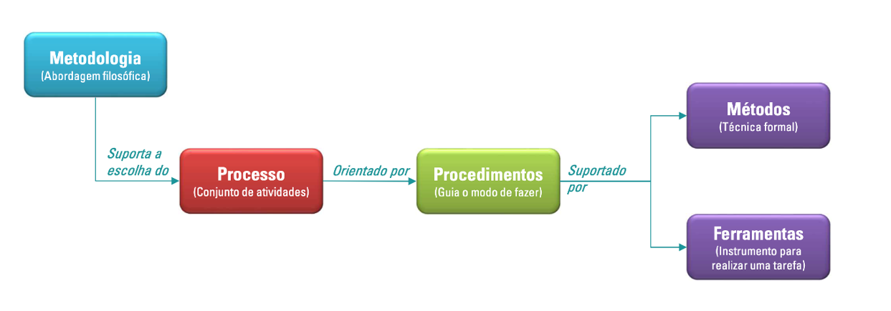

# <a> 1. Visão Geral do Produto </a>

---

## <a> 1.1 Problema </a>

Atualmente, a equipe FGR (Formula Racing Gama) da Universidade de Brasília enfrenta desafios significativos na gestão e divulgação das vendas de seus produtos, especialmente camisetas. As vendas são realizadas principalmente por meio de redes sociais e comunicações via WhatsApp, o que resulta em dificuldades no controle de estoque, acompanhamento das transações e consolidação de dados financeiros. Este método descentralizado limita a eficiência operacional, cria inconsistências nos registros de vendas e aumenta o esforço manual necessário para gerenciar pedidos.

Além disso, esse processo apresenta as seguintes complicações principais:

- Erros em Processos Manuais: O controle de vendas e estoque, realizado de forma manual, está sujeito a falhas que comprometem a precisão das informações e dificultam a tomada de decisão.

- Ineficiência na Comunicação: A divulgação de produtos e do propósito da equipe é limitada a redes sociais e WhatsApp, restringindo o alcance ao público e prejudicando a promoção da marca e de seus patrocinadores.

- Dificuldade na Promoção de Patrocinadores: O método atual não permite uma exibição eficiente e impactante dos patrocinadores, o que pode enfraquecer os benefícios oferecidos a eles.

- Dificuldade na Gestão de Estoque: O controle manual do estoque aumenta a probabilidade de erros, como vendas de produtos fora de estoque ou discrepâncias nos registros.

- Falta de Centralização e Profissionalismo: A ausência de uma plataforma estruturada compromete a imagem da equipe, transmitindo desorganização e dificultando a consolidação de novas oportunidades de negócio.
Adicionalmente, a ausência de um canal oficial e estruturado impacta negativamente a visibilidade e a promoção da equipe junto a seus patrocinadores e apoiadores. Uma plataforma que centraliza as vendas e também permite a apresentação institucional da equipe, bem como a divulgação de seus patrocinadores, é essencial para fortalecer a imagem da equipe, melhorar a experiência de compra dos clientes e atrair novos parceiros.

Por isso, o desenvolvimento de um E-commerce personalizado para a FGR visa solucionar essas limitações, integrando funcionalidades de gestão de vendas, apresentação da equipe e exibição de patrocinadores, criando um canal profissional e eficiente que reflita o dinamismo e o espírito inovador da equipe.

---

## <a> 1.2 Declaração de Posição Produto </a>

    A segguir, apresenta-se o posicionamento exclusivo que o produto pretende preencher no mercado, destacando sua intenção, finalidade, públicos-alvos e importância. Esses aspectos foram definidos para guiar o desenvolvimento e alinhar a solução às necessidades da equipe e do mercado.

| 🎯 **Para**             | Público geral(divulgação e vendas) e FGR(gestão)                                      |
|----------------------|---------------------------------------------------------|
| 📌 **Necessidade**     | Necessidade de um ambiente mais organizado e estruturado para divulgação dos projetos da equipe em si, e uma plataforma que ajuda na venda dos produtos. Oferecer uma canal estruturado para a divulgação da equipe e dos patrocinadores. |
| 🛍️ **O (nome do produto)**       | FGR E-commerce.                                      |
| ⚙️ **Que**              | Permite realizar vendas de forma eficiente, manter controle do gerenciamento de vendas e promover a equipe e patrocinadores um ambiente profissional e acessível. |
| ❌ **Ao Contrário**    | De métodos manuais e descentralizados, como redes sociais e WhatsApp, que dificultam a gestão, geram incosistências nos registros e limitam a visibilidade dos patrocinadores. Sem o produto, a equipe continua enfrentando desafios operacionais e de crescimento. |
| ✅ **Nosso Produto**   | Oferece uma solução integrada, que une funcionalidade, profissionalismo e uma experiência otimizada para clientes, com uma interface intuitiva que facilita a navegação, seleção de produtos e realização de pagamentos. Além disso, o desenvolvimento sustentável da equipe ao reduzir a dependência de processos manuais. |

---

## <a> 1.3 Objetivos do Produto</a>

Ao desenvolver o seu próprio marketplace a Fórmula Gama Racing consegue centralizar suas vendas de produtos em um lugar só, o que antes seria uma conversa no whatsapp ou no instagram para discutir os valores dos produtos, o tamanho das camisetas, onde elas seriam entregues, quem estava comprando e qual era o método de pagamento, passa a ser automatizado em seu website. Isso economiza tempo de ambas as partes, dado que o comprador não precisa que um integrante da FGR esteja disponível para atendê-lo e os membros da equipe podem se dedicar em outras funções.
Com isso, o gerenciamento de vendas e pedidos da equipe irá melhorar, uma vez que poderão ver se um pedido ainda deve ser entregue, assim como o número de pedidos em um determinado período facilitando o controle do estoque aliado a uma forma mais simples de analisar quais itens estão dando maior retorno financeiro e quais podem ser melhor divulgados. 
Desta forma, o principal objetivo é a criação de uma plataforma integrada de marketplace para automatizar as vendas e o gerenciamento de produtos da FGR, otimizando os processos internos e fortalecendo a experiência dos clientes. Outros pontos importantes são: 

1. Introdução da equipe de competição para os visitantes do site, apresentando sua história, conquistas e integrantes, promovendo a identidade da equipe e fortalecendo sua conexão com o público;
2. Destaque dos diferentes patrocinadores da FGR: oferecer uma seção dedicada para exibir os patrocinadores da FGR, valorizando a parceria e ampliando a visibilidade das marcas;
3. Facilidade no Controle de Estoque: Permite que a equipe gerencie o estoque de maneira mais eficiente, identificando produtos mais vendidos e gerando insights para melhorias na divulgação e produção;
4. Economia de tempo e automação: Reduzir a dependências de interações manuais entre os compradores e membros da equipe, economizando tempo e permitindo maior dedicação às atividades técnicas e estratégicas da FGR;
5. Aprimoramento da Análise Financeira: Fornecer relatórios detalhados que auxiliem na análise do desempenho financeiro, facilitando decisões baseadas em dados sobre os produtos;
Tais objetivos garantem que o produto não seja apenas uma ferramenta de vendas, mas uma solução completa que contribua para o crescimento sustentável da Fórmula Gama Racing, fortalecendo sua presença e promovendo maior eficiência interna entre os membros.

Tais objetivos garantem que o produto não seja apenas uma ferramenta de vendas, mas uma solução completa que contribua para o crescimento sustentável da Fórmula Gama Racing, fortalecendo sua presença e promovendo maior eficiência interna entre os membros.

---

## <a> 1.4 Tecnologias a Serem Utilizadas </a>

Nesta seção, são descritas as tecnologias selecionadas para o desenvolvimento do projeto, abrangendo as linguagens de programação, metodologias de trabalho, técnicas aplicadas e ferramentas utilizadas.

| 💻 **Categoria**          | 🛠️ **Ferramentas/Tecnologias** |
|--------------------------|--------------------------------|
| 📌 **Metodologias Ágeis** | Scrum, XP                     |
| 🎨 **Front-end**          | JavaScript                    |
| ⚙️ **Back-end**           | Python                         |
| 🗄️ **Banco de Dados**     | SQL                            |
| 📚 **Frameworks**         | React, Django                 |
| 🎨 **Prototipação**       | Figma                         |
| 💬 **Comunicação**        | WhatsApp, Teams, Discord      |
| 🔄 **Versionamento de Código** | Git, GitHub                 |

---

# <a> 2. Visão Geral do Projeto </a>

---

## <a> 2.1 Ciclo de vida do Projeto de Desenvolvimento de Software </a>

  

