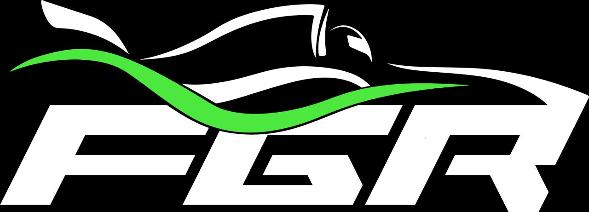

# <a>GEMINI - FGR E-commerce</a>

    
    
<b>Figura 1:</b> Logo FGR

## <a> Sobre o Projeto</a>

A FGR ao desenvolver o seu próprio marketplace a Fórmula Gama Racing consegue centralizar suas vendas de produtos em um lugar só, o que antes seria uma conversa no whatsapp ou no instagram para discutir os valores dos produtos, o tamanho das camisetas, onde elas seriam entregues, quem estava comprando e qual era o método de pagamento, passa a ser automatizado em seu website. • Isso economiza tempo de ambas as partes, dado que o comprador não precisa que um integrante da FGR esteja disponível para atendê-lo e os membros da equipe podem se dedicar em outras funções. • Com isso, o gerenciamento de vendas e pedidos da equipe irá melhorar, uma vez que poderão ver se um pedido ainda deve ser entregue, assim como o número de pedidos em um determinado período facilitando o controle do estoque aliado a uma forma mais simples de analisar quais itens estão dando maior retorno financeiro e quais podem ser melhor divulgados.

## <a> Funcionalidades </a>

Este projeto oferece as seguintes funcionalidades:

- Introdução da equipe de competição para os visitantes do site, apresentando sua história, conquistas e integrantes;
- Destaque dos diferentes patrocinadores da FGR.

## <a> Equipe </a>

<table>
  <tr>
    <td align="center"><a href="https://github.com/eduardoferre"> <b>Eduardo Ferreira</b></a></td>
    <td align="center"><a href="https://github.com/Edzada"> <b>Esdras de Sousa</b></a></td>
    <td align="center"><a href="https://github.com/uires2023"> <b>Uires Carlos</b></a></td>
    <td align="center"><a href="https://github.com/audittmega"> <b>Thiago Tonin</b></a></td>
  </tr>
  <tr>
    <td align="center"><a href="#"> <b>Participante 5</b></a></td>
    <td align="center"><a href="#"> <b>Participante 6</b></a></td>
    <td align="center"><a href="#"> <b>Participante 7</b></a></td>
    <td align="center"><a href="#"> <b>Participante 8</b></a></td>
  </tr>
  <tr>
    <td align="center"><a href="#"> <b>Participante 9</b></a></td>
    <td align="center"><a href="#"> <b>Participante 10</b></a></td>
  </tr>
</table>

